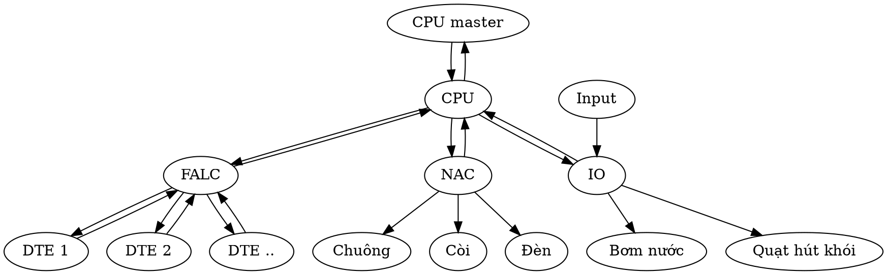

#HỆ THỐNG GIÁM SÁT BÁO CHÁY

##MÔ HÌNH PHẦN CỨNG TỦ BÁO CHÁY

***DTE***: Đầu báo (khói, nhiệt, kết hợp) dùng để giám sát môi trường và gửi trạng thái về FALC. Nếu giá trị đo vượt ngưỡng giới hạn thì gửi cảnh báo về FALC
***FALC***: Mạch giám sát đầu báo có nhiệm vụ hỏi và thu thập dữ liệu, trạng thái từ các DTE. Nếu có lệnh set ngưỡng cảnh báo thì gửi giá trị giới hạn mới đến DTE tương ứng
***NAC***: Mạch điều khiển chuông còi khi có lệnh điều khiển từ CPU, đồng thời gửi trang thái các output về CPU khi được hỏi
***IO***: Mạch quản lý ngoại vi điều khiển các thiết bị khác (bơm nước, quạt hút khói, ...), đồng thời gửi trạng thái input khi được CPU hỏi
***CPU***: Bộ xử lý có nhiệm vụ hỏi và thu thập dữ liệu, trạng thái từ các FALC, NAC, IO và điều khiển các board này

##CHỨC NĂNG CẦN CÓ TRÊN PHẦN MỀM CPU

####Quản lý FALC
- [x] Danh sách FALC
  - [x] Số lượng DTE theo loại
  - [x] Số lượng DTE theo trạng thái
  - [x] Trạng thái của FALC
  - [x] Thời gian cấp nhật

- [ ] Thêm FALC: Thêm FALC mới vào hệ thống (Quản lý theo ID)
  - [ ] -1 < ID < 10
  - [ ] Không trùng ID đã tồn tại
  - [ ] Ghi chú dưới 50 ký tự
  - [ ] 0 < Số DTE mỗi lần đọc < 10
  
- [ ] Sửa FALC: Sửa thông tin FALC gồm ID, ghi chú, số DTE mỗi lần đọc
  - [ ] -1 < ID < 10
  - [ ] Không trùng ID đã tồn tại
  - [ ] Ghi chú dưới 50 ký tự
  - [ ] 0 < Số DTE mỗi lần đọc < 10
  
- [ ] Xóa FALC: Xóa FALC ra khỏi hệ thống
  - [ ] Không cho xóa FALC nếu còn chứa DTE
  - [ ] Hỏi xác nhận lại trước khi xóa

- [x] Quản lý danh sách đầu báo (DTE) trên FALC
  - [x] Báo trạng thái các DTE
    - [x] Loại đầu báo
    - [x] Giá trị đo
    - [x] Trạng thái: enable, connect, alarm,... (chữ + màu)
    - [x] Thời gian cập nhật
    
  - [x] Thêm ID DTE (Các thông tin khác của DTE sẽ được cập nhật khi đọc FALC)
  - [x] Xóa DTE (Hỏi lại trước khi xóa)
  - [x] Enable/Disable DTE (Hỏi lại trước khi Disable)

####Quản lý mạch điều khiển chuông còi (NAC)
- [x] Danh sách NAC
  - [x] Trạng thái NAC
  - [x] Trạng thái các đầu output
  - [x] Thời gian cập nhật
- [ ] Thêm NAC
  - [ ] -1 < ID < 10
  - [ ] Không trùng ID đã tồn tại
  - [ ] Ghi chú dưới 30 ký tự
  - [ ] Đặt tên các output (giới hạn 10 ký tự)
- [x] Sửa NAC
  - [ ] -1 < ID < 10
  - [ ] Không trùng ID đã tồn tại
  - [ ] Ghi chú dưới 30 ký tự
  - [ ] Đặt tên các output (giới hạn 10 ký tự)
- [ ] Xóa NAC
  - [ ] Không cho xóa NAC được khai báo điều khiển
  - [x] Hỏi lại trước khi xóa

- [x] Điều khiển chuông còi

####Quản lý mạch ngoại vi (IO)
- [x] Danh sách IO
  - [x] Trạng thái IO
  - [x] Trạng thái các đầu output
  - [x] Thời gian cập nhật
- [x] Thêm IO
- [x] Sửa IO
- [x] Xóa IO
- [x] Điều khiển thiết bị ngoại vi (bơm, quạt hút khói, ...)

####Quản lý vùng cảnh báo (Zone)
- [x] Thêm Zone
- [x] Sửa Zone
- [x] Xóa Zone